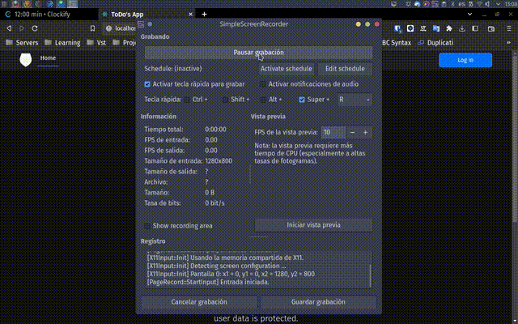

# ToDo-JavaSpringspringboot

 
This project is a web application for managing user's to-do lists. It allows users to create, read, update, and delete to-do items. The application is built using Spring Boot, Spring Data JPA, and a relational database. It includes features such as pagination, filtering, sorting, and security.

attached is a collection of postman endpoin called ToDo.postman_collection.json

Instructions to run the project:
### Backend
#### Database
The database name must be "Todo", and it can be either MariaDB or MySQL. If the application fails to connect to the database, please check the "application.properties" file in the Java project. The default port number for the database is 3306. The application includes some @Bean with sample data that will be loaded upon running the application.

#### Java SpringBoot
Make sure you have at least Java 8 or later installed on your computer.
Clone the project repository from GitHub.
Open a terminal window and navigate to the project directory.
Run the command "mvn spring-boot:run" to build and run the application.
Once the application has started, open a web browser and navigate to "http://localhost:8080" to access the application.
Note: Before running the application, you may need to configure the database settings in the "application.properties" file located in the "src/main/resources" directory. Also, you can modify the number of records displayed per page, by changing the value of the "app.pagination.page-size" property in the same file.

### Frontend
Open a terminal and navigate to the root directory of the project.
Navigate to the client directory by running the command cd client.
Install the necessary dependencies by running the command npm install.
Start the development server by running the command npm start.
The app should now be running in your browser at http://localhost:3000.
